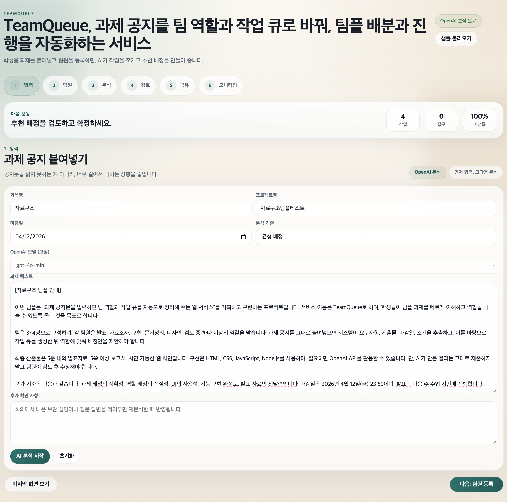
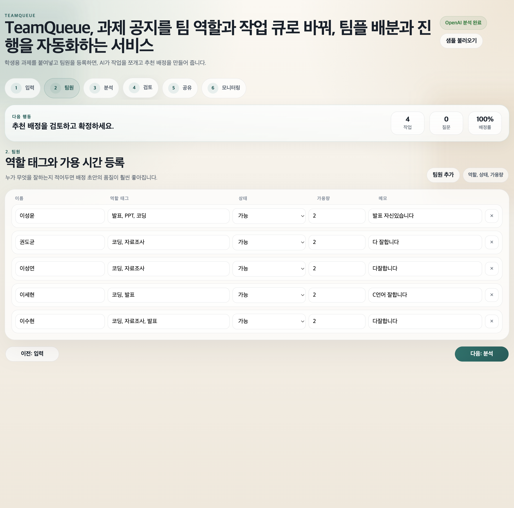
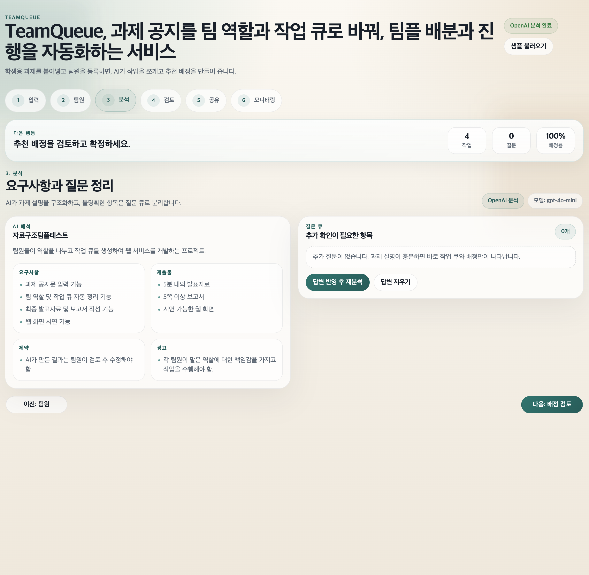
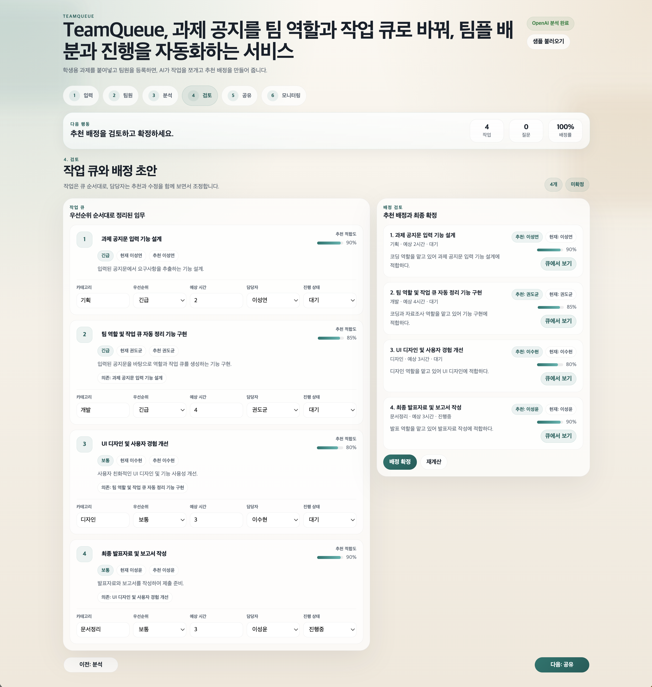
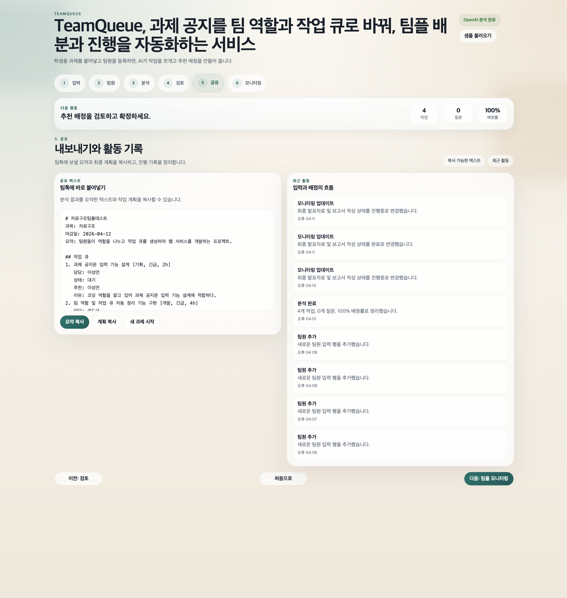
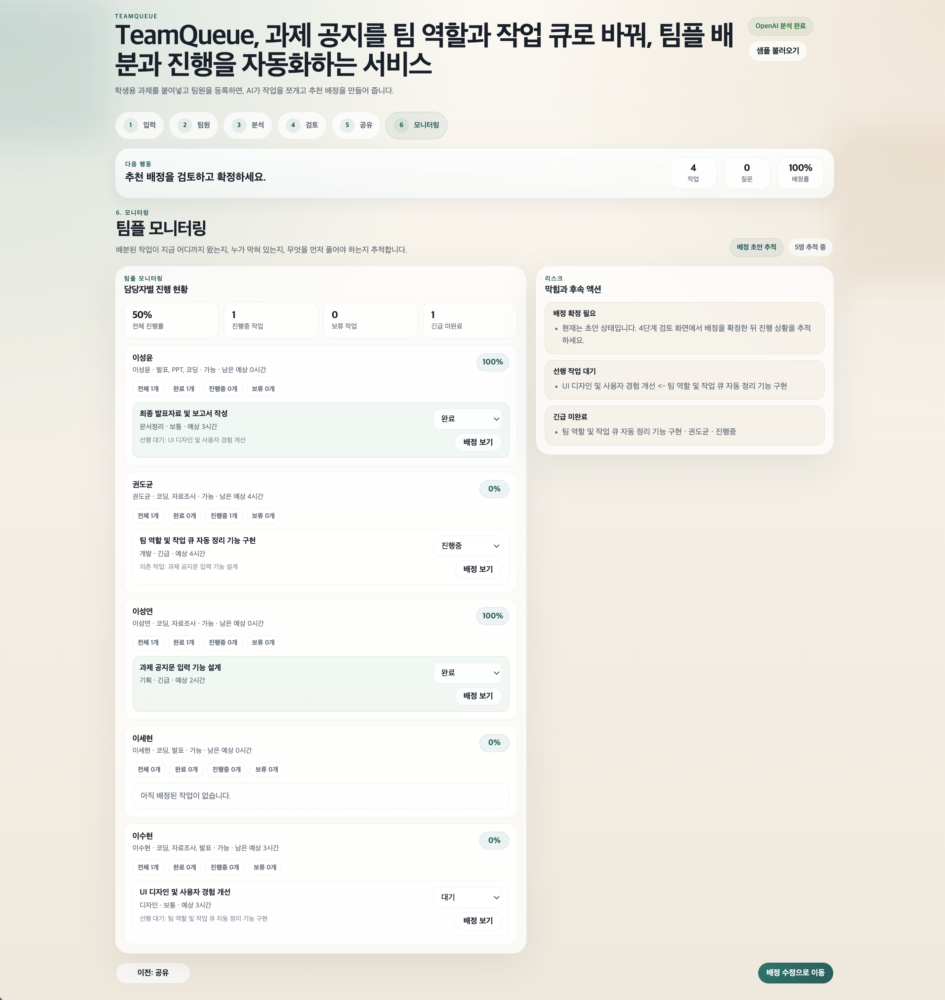

# TeamQueue

TeamQueue turns a class assignment brief into a task queue and a role-based assignment draft. It is designed for student team projects, where one person needs to read the brief, split the work, and keep the team moving without losing the big picture.

The app opens with a sample brief so you can demo it right away. If `OPENAI_API_KEY` is set, the backend calls OpenAI for the analysis step; otherwise it falls back to a local C engine (`teamqueue_engine.c`) so the workflow still works offline.

## Architecture

- Frontend: `index.html`, `styles.css`, `app.js`
- Backend: `server.js` on Node.js
- Local analysis engine: `teamqueue_engine.c` compiled to `teamqueue_engine`
- Optional AI path: OpenAI is used when a valid API key is present, and the app falls back to the local engine when it is not

## Run

```bash
cd /Users/seongyuniverse/Development/SKKU_DataStructure/assignment-planner-ai
npm start
```

Open `http://localhost:3000`.

## Environment

Create a file named `.env.local` in this folder, or copy from `.env.example`:

```bash
OPENAI_API_KEY=sk-...
OPENAI_MODEL=gpt-4o-mini
PORT=3000
```

Keep `.env.local` local only. The GitHub upload should include `.env.example`, not your private API key file.

## UX Flow

1. Paste the assignment brief.
2. Add or edit team members and role tags.
3. Run analysis to generate the task queue and assignment draft.
4. Fill in clarification questions if needed, then reanalyze.
5. Confirm the final assignment and copy the summary for your team chat.

## Screenshots

### 1. Input
과제 공지를 붙여넣고 분석 기준을 설정하는 시작 화면입니다.



### 2. Team
팀원별 역할 태그와 가능 시간을 등록해 배정 기준을 정리합니다.



### 3. Analysis
AI가 과제 요구사항과 질문을 구조화해 작업 큐를 만드는 단계입니다.



### 4. Review
추출된 작업을 검토하고 배정안을 확정하는 단계입니다.



### 5. Share
확정된 결과를 복사해서 팀 채팅이나 공유 문서에 바로 붙여 넣을 수 있습니다.



### 6. Monitoring
배정된 작업의 진행률과 상태를 추적하는 팀플 모니터링 화면입니다.



## Optional OpenAI API

Set your key in `.env.local` before starting, or export the variables in the shell if you prefer. If no key is set, the app falls back to a local heuristic analyzer so it still runs offline.

## GitHub-safe checklist

- `.env.local` stays on your machine and is ignored by Git.
- `.env.example` is the committed template you can share safely.
- `teamqueue_engine` and `node_modules/` are ignored so build artifacts do not get uploaded.
- The repository includes a project description, run instructions, architecture notes, and usage flow.
